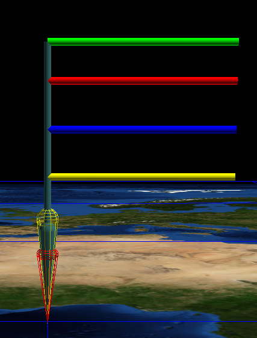

Example 1
=========

First, import from required libraries

Import::

    import pandas as pd
    from matritools import nodefile as nf, utils as mu

Next, we can create some data, load it into a pandas DataFrame, and establish a node file.

Create Data::

    my_data = {
    'Name'         : ['Kevin', 'Lisa', 'Ranir', 'Abigale', 'Robert', 'Fran'],
    'Height'       : [71, 64, 75, 59, 55, 50],
    'Weight'       : [184, 142, 209, 119, 220, 158],
    'Age'          : [26, 43, 31, 56, 29, 30],
    'Bank Balance' : [1.06, 3567.40, 300.00, 536.37, 126.57, -35.00]
    }

    df = pd.DataFrame(my_data)

    ntf = nf.NodeFile("Example 2")

Now lets create a glyph template inside of antz to represent data points of one person.

Let's make a simple 3D bar graph to show the data of each person.

Let us represent a data values by adjusting the length of each of the colored rods, sticking out of
the side.

Let the green rod represent height, red represent weight, blue represent age, and yellow represent
bank account balance.

In order to use this template, we need to get the csv file created from saving our template in Antz
and place it in the same directory as our script. Lets name it "Example_2_Template.csv".

Now, in order for us to change the length of our rods, we need to know which row in
"Example_2_Template.csv" is which rod. The easiest way to identify them is know how they are the
same, and know how they are different.

Below is a condensed version of the node file template.

+-----+----+------+---------+---------+---------+
| Row | ID | topo | color_r | color_g | color_b |
+=====+====+======+=========+=========+=========+
| 0   | 38 | 5    | 50      | 101     | 101     |
+-----+----+------+---------+---------+---------+
| 1   | 39 | 6    | 50      | 101     | 101     |
+-----+----+------+---------+---------+---------+
| 2   | 40 | 6    | 255     | 0       | 0       |
+-----+----+------+---------+---------+---------+
| 3   | 41 | 6    | 0       | 0       | 255     |
+-----+----+------+---------+---------+---------+
| 4   | 42 | 6    | 255     | 255     | 0       |
+-----+----+------+---------+---------+---------+
| 5   | 43 | 6    | 0       | 255     | 0       |
+-----+----+------+---------+---------+---------+

In this case, they are all rods and know they are all
different colors. So lets look in file and search under the column "topo" and notice that all of
numbers are 6 except 1. We know that our template is made of all rods except for one peice so we
can assume a topo of 6 means rod, if we didn't know that already.

Next we can look for the columns color_r, color_g, and color_b. We can see that the rows 2 - 5
are the rows that are colored differently. Lets write this down

+---+--------+
| 2 | red    |
+---+--------+
| 3 | green  |
+---+--------+
| 4 | yellow |
+---+--------+
| 5 | blue   |
+---+--------+

Now that we are familiar with our node file. Lets establish our AntzGlyph object, make some scalars
and define how far apart we want to space our glyphs.

Set up AntzGlyph, scalars and unit distance::

    glyph = nf.AntzGlyph("Example_2_Glyph_Template.csv")

    # some times when saving the template in Antz, by default all rows are selected. Call this unselect them all
    glyph.unselect_all()

    # make a reusable function that scales a value originally between the min and max height to be within 0.1, 1.
    # this is used to change all of the values of height to be within 0.1, 1 but keep the same relative distance between
    # each value
    height_scalar = mu.make_interpolator(min(my_data['Height']), max(my_data['Height']), 0.1, 1)
    weight_scalar = mu.make_interpolator(min(my_data['Weight']), max(my_data['Weight']), 0.1, 1)
    age_scalar = mu.make_interpolator(min(my_data['Age']), max(my_data['Age']), 0.1, 1)
    bank_scalar = mu.make_interpolator(min(my_data['Bank Balance']), max(my_data['Bank Balance']), 0.1, 1)

    unit_distance = 20

Finally, lets iterate through the data and modify the glyph template each iteration.

Modify the glyph::

    for index, row in df.iterrows():

        # set the tag and tag mode of the root node row
        glyph.node_file_rows[0].set_tag(row["Name"], 1)

        # set x position
        glyph.node_file_rows[0].translate_x = index * unit_distance

        # set weight rod length
        glyph.node_file_rows[2].scale_z = weight_scalar(row['Weight'])

        # set height rod length
        glyph.node_file_rows[3].scale_z = height_scalar(row['Height'])

        # set bank rod length
        glyph.node_file_rows[4].scale_z = bank_scalar(row['Bank Balance'])

        # set age rod length
        glyph.node_file_rows[5].scale_z = age_scalar(row['Age'])

        # set the tag and tag mode to display the un-interpolated value
        glyph.node_file_rows[2].set_tag(row['Weight'], 8)
        glyph.node_file_rows[3].set_tag(row['Height'], 8)
        glyph.node_file_rows[4].set_tag(row['Bank Balance'], 8)
        glyph.node_file_rows[5].set_tag(row['Age'], 8)

        # add all NodeFileRows of glyph to the NodeFile and increment all of the IDs of the glyph
        ntf.add_glyph(glyph)

    # create csv file to use in Antz
    ntf.write_to_csv()

Final Code::

    import pandas as pd
    from matritools import nodefile as nf, utils as mu

    my_data = {
        'Name'         : ['Kevin', 'Lisa', 'Ranir', 'Abigale', 'Robert', 'Fran'],
        'Height'       : [71, 64, 75, 59, 55, 50],
        'Weight'       : [184, 142, 209, 119, 220, 158],
        'Age'          : [26, 43, 31, 56, 29, 30],
        'Bank Balance' : [1.06, 3567.40, 300.00, 536.37, 126.57, -35.00]
    }

    df = pd.DataFrame(my_data)

    ntf = nf.NodeFile("Example 2")

    glyph = nf.AntzGlyph("Example_2_Glyph_Template.csv")

    # some times when saving the template in Antz, by default all rows are selected. Call this unselect them all
    glyph.unselect_all()

    # make a reusable function that scales a value originally between the min and max height to be within 0.1, 1.
    # this is used to change all of the values of height to be within 0.1, 1 but keep the same relative distance between
    # each value
    height_scalar = mu.make_interpolator(min(my_data['Height']), max(my_data['Height']), 0.1, 1)
    weight_scalar = mu.make_interpolator(min(my_data['Weight']), max(my_data['Weight']), 0.1, 1)
    age_scalar = mu.make_interpolator(min(my_data['Age']), max(my_data['Age']), 0.1, 1)
    bank_scalar = mu.make_interpolator(min(my_data['Bank Balance']), max(my_data['Bank Balance']), 0.1, 1)

    unit_distance = 20

    for index, row in df.iterrows():

        # set the tag and tag mode of the root node row
        glyph.node_file_rows[0].set_tag(row["Name"], 1)

        # set x position
        glyph.node_file_rows[0].translate_x = index * unit_distance

        # set weight rod length
        glyph.node_file_rows[2].scale_z = weight_scalar(row['Weight'])

        # set height rod length
        glyph.node_file_rows[3].scale_z = height_scalar(row['Height'])

        # set bank rod length
        glyph.node_file_rows[4].scale_z = bank_scalar(row['Bank Balance'])

        # set age rod length
        glyph.node_file_rows[5].scale_z = age_scalar(row['Age'])

        # set the tag and tag mode to display the un-interpolated value
        glyph.node_file_rows[2].set_tag(row['Weight'], 8)
        glyph.node_file_rows[3].set_tag(row['Height'], 8)
        glyph.node_file_rows[4].set_tag(row['Bank Balance'], 8)
        glyph.node_file_rows[5].set_tag(row['Age'], 8)

        # add all NodeFileRows of glyph to the NodeFile and increment all of the IDs of the glyph
        ntf.add_glyph(glyph)

    # create csv file to use in Antz
    ntf.write_to_csv()

Final Result:

.. image:: Example_2_result.png