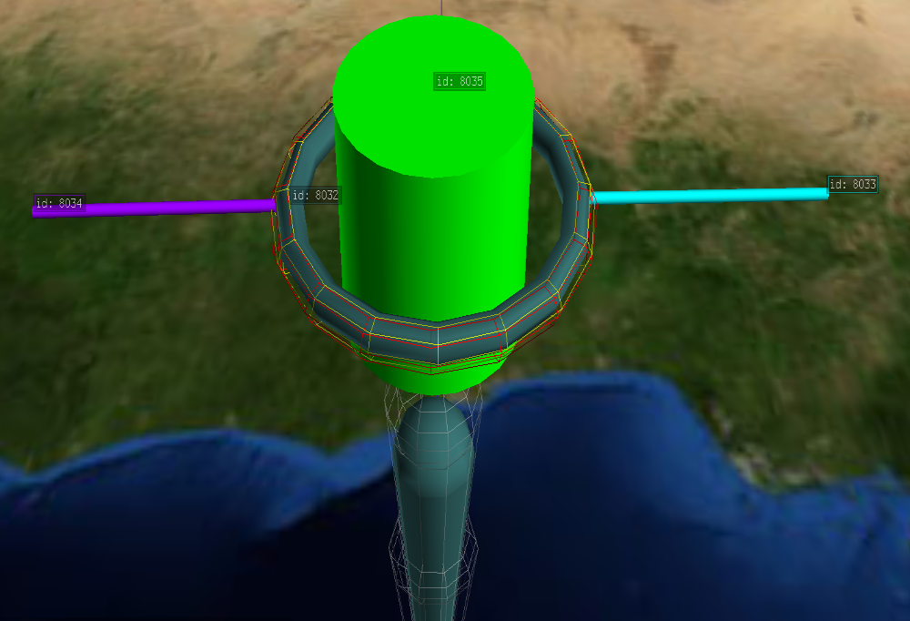

.. include:: .special.rst
Example 1
=========

First, import from required libraries

Import::

    import pandas as pd
    import copy
    from matritools import nodefile as nf, utils as mu

Next, we can create some data, load it into a :variable:`pandas DataFrame` and establish a
:variable:`NodeFile`.

Create Data::

    my_data = {
    'Name'     : ['Kevin',              'Lisa', 'Ranir',     'Abigale', 'Robert',              'Fran'],
    'Sex'      : [    'M',                 'F',     'M',           'F',      'M',                 'F'],
    'Height'   : [     71,                  64,      75,            59,       55,                  50],
    'Weight'   : [    184,                 142,     209,           119,      220,                 158],
    'Age'      : [     26,                  43,      31,            56,       29,                  30],
    'CatColors': [   'na', 'black,brown,white',    'na',       'black', 'orange',                'na'],
    'DogColors': [   'na',                'na', 'brown', 'black,white',   'grey', 'black,brown,white']
    }

    df = pd.DataFrame(my_data)

    ntf = nf.NodeFile("Example 3")

Now lets create a glyph template inside of antz to represent data points of one person.

Let's make a simple 3D bar graph to show the data of each person.

Let us represent a data values by adjusting the :variable:`scale` of each of the cylinder in the middle.

Let the :variable:`height' or :variable:`scale_z' represent the :variable:`height`, and :variable:`scale_x`
and :variable:`scale_y` represent :variable:`weight` and finally, let the :variable:`color` represent age.

Each person has a number of cats and or dogs, given by how many colors were list of their cats or dogs.
Lets represent each cat or dog and their color by adding a colored rings to the rods sticking out of the side.
Let the :cyan:`cyan` rod be for cats, and the :purple:`purple` rod be for dogs.

Lastly, lets separate our people based on sex. We can parent the glyph to 1 of two grids, a blue and pink one,
and place the grids side by side.

In order to use this template, we need to get the csv file created from saving our template in Antz
and place it in the same directory as our script. Lets name it :filename:`"Example_3_Template.csv"`.

Now, in order for us to modify our :variable:`glyph`, we need to know which row in
:filename:`"Example_3_Template.csv"` is which part of the glyph. The easiest way to identify them
is know how they are the same, and know how they are different.

Below is a condensed version of the node file template.

+-----+----+------+----------------+------------------+-----------------+
| Row | ID | topo | :red:`color_r` | :green:`color_g` | :blue:`color_b` |
+=====+====+======+================+==================+=================+
| 0   | 38 | 5    | 50             | 101              | 101             |
+-----+----+------+----------------+------------------+-----------------+
| 1   | 39 | 3    | 50             | 101              | 101             |
+-----+----+------+----------------+------------------+-----------------+
| 2   | 40 | 13   | 0              | 255              | 255             |
+-----+----+------+----------------+------------------+-----------------+
| 3   | 41 | 13   | 152            | 0                | 255             |
+-----+----+------+----------------+------------------+-----------------+
| 4   | 42 | 4    | 50             | 101              | 101             |
+-----+----+------+----------------+------------------+-----------------+

In this case, we have 2 rods that are different colors, 1 cylinder, 1 toroid and 1 pin.
So lets look in file and search under the column :variable:`"topo"` and
notice that we have 2 number 13s. If we didn't know 13 was rod, we can deduce it here.

Another way to identify parts is to look up topo and geometry IDs
`here <https://matritools.readthedocs.io/en/latest/nodefilerow-attributes.html>`_

You could also load your template into a fresh instance of Antz and click on various objects to get its
ID, but this can prove to be unreliable, so its good to know other ways.

We can save references to individual NodeFileRow's in our code.

Define key nodes from your glyph and modify properties that will remain constant::

    root = glyph.node_file_rows[0]
    cat_rod = glyph.node_file_rows[2]
    dog_rod = glyph.node_file_rows[3]
    height_weight_age_cylinder = glyph.node_file_rows[4]

    # set properties of glyph that will remain constant

    # if a NodeFileRow's color_r, color_g, color_b all are set to 0
    # its color is determined by its palette_id, and its color_id

    # a NodeFileRow's color_id maps to a color relative to its palette_id
    # for exampe, palette_id 0 maps color_id 1 to lime green, 2 to red, and 3 to blue
    # while palette_id 6 maps 1 - 127 to be colors on a spectrum from green to red
    # a spectrum is useful for displaying values in a range by color
    height_weight_age_cylinder.color_r = 0
    height_weight_age_cylinder.color_g = 0
    height_weight_age_cylinder.color_b = 0
    height_weight_age_cylinder.color_a = 255
    height_weight_age_cylinder.palette_id = 6
    root.set_u_scale(4)

Now that we are familiar with our node file. Lets establish our :variable:`AntzGlyph` object,
make some scalars and define how far apart we want to space our glyphs.

Set up :variable:`AntzGlyph`, scalars and unit distance::

    glyph = nf.AntzGlyph("Example_3_Glyph_Template.csv")

    # some times when saving the template in Antz, by default all rows are selected. Call this unselect them all
    glyph.unselect_all()

    # make a reusable function that scales a value originally between the min and max height to be within 0.1, 1.
    # this is used to change all of the values of height to be within 0.1, 1 but keep the same relative distance between
    # each value
    height_cylinder_z_scalar = mu.make_df_column_interpolator(df['Height'], 0.1, 1)
    weight_cylinder_xy_scalar = mu.make_df_column_interpolator(df['Weight'], 0.1, 1)
    age_cylinder_color_scalar = mu.make_df_column_interpolator(df['Age'], 0, 127)

    # used to space glyphs apart
    unit_distance = 50
    cat_dog_ring_distance = 50

    # used to hold temporary NodeFileRows
    temp_rows = []

Now, lets set up our grids::

    # build male grid

    # create_node_row() returns an instance of a NodeFileRow and adds it to the NodeFile
    male_grid = ntf.create_node_row()
    male_grid.geometry = nf.NodeFileRow.geos["plane"]

    # when adding NodeFileRows manually to a NodeFile, we must manage the ID's
    # to avoid having duplicate ID's in our NodeFile
    male_grid.set_id(ntf.get_last_row().id + 1)
    male_grid.set_color_by_name("blue")
    male_grid.set_translate(-75)
    male_grid.set_scale(0.25, 0.25, 0.25)

    # type 6 makes it a grid
    male_grid.type = 6

    # build female grid

    # create a deep copy of male_grid and modify it accordingly
    female_grid = copy.deepcopy(male_grid)
    female_grid.set_id((ntf.get_last_row().id + 1))
    female_grid.set_color_by_name('hot pink')
    female_grid.set_translate(75)

    # since we created female_grid from a copy, we have to add it to the NodeFile
    ntf.node_file_rows.append(female_grid)

Because we added NodeFileRows manually, we need to ensure that our glyph doesn't share any ID's
with the NodeFile. One way to do this is to call the glyphs method make_ids_consecutive and feed it
the last ID of the NodeFile + 1::

    glyph.make_ids_consecutive(ntf.get_last_row().id + 1)

Instead of modifying everything inside of the main loop, lets write functions to organize our work.::

    # declare helper functions for organization

    def modify_root(index, row):
        # set the tag and tag mode of the root node row
        root.set_tag(row["Name"], 1)

        # set x position
        root.translate_x = index * unit_distance

        # set parent id to be the id of the respective grid
        root.parent_id = male_grid.id if row['Sex'] == 'M' else female_grid.id

    def modify_height_weight_age_cylinder(row):
        # set cylinder scale
        x = y = weight_cylinder_xy_scalar(row['Weight'])
        z = height_cylinder_z_scalar(row['Height'])
        height_weight_age_cylinder.set_scale(x, y, z)

        # set the color_id to display a color on a spectrum relative to its palette_id
        height_weight_age_cylinder.color_id = age_cylinder_color_scalar(row['Age'])

        # set the tag and tag mode to display the un-interpolated value
        height_weight_age_cylinder.set_tag('Weight: ' + str(row['Weight']) +
                                           ', Height: ' + str(row['Height']) +
                                           ', Age: ' + str(row['Age']))

    def modify_rod(rod, data_value):
        # skip function if value is na
        if data_value == 'na':
            return

        # split the string of colors by ',' to get a list of strings
        colors = data_value.split(',')

        # create a ring for each cat or dog color in the list
        for i in range(len(colors)):

            # by default, NodeFileRows are toroids
            ring = nf.NodeFileRow()

            # set position of ring on rod
            ring.translate_x = i * cat_dog_ring_distance

            # manage duplicate_ids
            ring.set_id(glyph.get_last_row().id + 1)

            # set color of toroid based on color value
            ring.set_color_by_name(colors[i])

            # parent new ring to the rod
            ring.parent_id = rod.id

            # add ring to glyph template
            glyph.node_file_rows.append(ring)

            # add ring to temp_rows to be removed later
            temp_rows.append(ring)

Finally, lets iterate through the data and call our functions each iteration and be sure to clean up any
unwanted changes to our glyph.

Modify the glyph::

    for index, row in df.iterrows():

        # call helper functions to modify the glyph template
        modify_root(index, row)
        modify_height_weight_age_cylinder(row)
        modify_rod(cat_rod, row['CatColors'])
        modify_rod(dog_rod, row['DogColors'])

        # add copies of all NodeFileRows from glyph to NodeFile
        ntf.add_glyph(glyph)

        # all changes, such as adding rings, made to the glyph remain and can effect the logic of next iteration of the loop
        # after adding the glyph's NodeFileRows to the NodeFile, it may be necessary to do some clean up such as
        # removing the rings we added.
        for node_row in temp_rows:
            glyph.node_file_rows.remove(node_row)
        temp_rows.clear()

    # create csv file to use in Antz
    ntf.write_to_csv()

Final Code::

    import pandas as pd
    import copy
    from matritools import nodefile as nf, utils as mu

    my_data = {
        'Name'     : ['Kevin',              'Lisa', 'Ranir',     'Abigale', 'Robert',              'Fran'],
        'Sex'      : [    'M',                 'F',     'M',           'F',      'M',                 'F'],
        'Height'   : [     71,                  64,      75,            59,       55,                  50],
        'Weight'   : [    184,                 142,     209,           119,      220,                 158],
        'Age'      : [     26,                  43,      31,            56,       29,                  30],
        'CatColors': [   'na', 'black,brown,white',    'na',       'black', 'orange',                'na'],
        'DogColors': [   'na',                'na', 'brown', 'black,white',   'grey', 'black,brown,white']
    }

    df = pd.DataFrame(my_data)

    ntf = nf.NodeFile("Example 3")

    glyph = nf.AntzGlyph("Example_3_Glyph_Template.csv")

    # some times when saving the template in Antz, by default all rows are selected. Call this unselect them all
    glyph.unselect_all()

    # make a reusable function that scales a value originally between the min and max height to be within 0.1, 1.
    # this is used to change all of the values of height to be within 0.1, 1 but keep the same relative distance between
    # each value
    height_cylinder_z_scalar = mu.make_df_column_interpolator(df['Height'], 0.1, 1)
    weight_cylinder_xy_scalar = mu.make_df_column_interpolator(df['Weight'], 0.1, 1)
    age_cylinder_color_scalar = mu.make_df_column_interpolator(df['Age'], 0, 127)

    # used to space glyphs apart
    unit_distance = 50
    cat_dog_ring_distance = 50

    # used to hold temporary NodeFileRows
    temp_rows = []

    # build male grid

    # create_node_row() returns an instance of a NodeFileRow and adds it to the NodeFile
    male_grid = ntf.create_node_row()
    male_grid.geometry = nf.NodeFileRow.geos["plane"]

    # when adding NodeFileRows manually to a NodeFile, we must manage the ID's
    # to avoid having duplicate ID's in our NodeFile
    male_grid.set_id(ntf.get_last_row().id + 1)
    male_grid.set_color_by_name("blue")
    male_grid.set_translate(-75)
    male_grid.set_scale(0.25, 0.25, 0.25)

    # type 6 makes it a grid
    male_grid.type = 6

    # build female grid

    # create a deep copy of male_grid and modify it accordingly
    female_grid = copy.deepcopy(male_grid)
    female_grid.set_id((ntf.get_last_row().id + 1))
    female_grid.set_color_by_name('hot pink')
    female_grid.set_translate(75)

    # since we created female_grid from a copy, we have to add it to the NodeFile
    ntf.node_file_rows.append(female_grid)

    # because we added NodeFileRows manually, we need to ensure that our glyph doesn't share any ID's with the NodeFile
    # One way to do this is to call the glyphs method make_ids_consecutive and feed it the last ID of the NodeFile + 1
    glyph.make_ids_consecutive(ntf.get_last_row().id + 1)

    # define key nodes from your glyph
    root = glyph.node_file_rows[0]
    cat_rod = glyph.node_file_rows[2]
    dog_rod = glyph.node_file_rows[3]
    height_weight_age_cylinder = glyph.node_file_rows[4]

    # set properties of glyph that will remain constant

    # if a NodeFileRow's color_r, color_g, color_b all are set to 0
    # its color is determined by its palette_id, and its color_id

    # a NodeFileRow's color_id maps to a color relative to its palette_id
    # for exampe, palette_id 0 maps color_id 1 to lime green, 2 to red, and 3 to blue
    # while palette_id 6 maps 1 - 127 to be colors on a spectrum from green to red
    # a spectrum is useful for displaying values in a range by color
    height_weight_age_cylinder.color_r = 0
    height_weight_age_cylinder.color_g = 0
    height_weight_age_cylinder.color_b = 0
    height_weight_age_cylinder.color_a = 255
    height_weight_age_cylinder.palette_id = 6
    root.set_u_scale(4)

    # declare helper functions for organization

    def modify_root(index, row):
        # set the tag and tag mode of the root node row
        root.set_tag(row["Name"], 1)

        # set x position
        root.translate_x = index * unit_distance

        # set parent id to be the id of the respective grid
        root.parent_id = male_grid.id if row['Sex'] == 'M' else female_grid.id

    def modify_height_weight_age_cylinder(row):
        # set cylinder scale
        x = y = weight_cylinder_xy_scalar(row['Weight'])
        z = height_cylinder_z_scalar(row['Height'])
        height_weight_age_cylinder.set_scale(x, y, z)

        # set the color_id to display a color on a spectrum relative to its palette_id
        height_weight_age_cylinder.color_id = age_cylinder_color_scalar(row['Age'])

        # set the tag and tag mode to display the un-interpolated value
        height_weight_age_cylinder.set_tag('Weight: ' + str(row['Weight']) +
                                           ', Height: ' + str(row['Height']) +
                                           ', Age: ' + str(row['Age']))

    def modify_rod(rod, data_value):
        # skip function if value is na
        if data_value == 'na':
            return

        # split the string of colors by ',' to get a list of strings
        colors = data_value.split(',')

        # create a ring for each cat or dog color in the list
        for i in range(len(colors)):

            # by default, NodeFileRows are toroids
            ring = nf.NodeFileRow()

            # set position of ring on rod
            ring.translate_x = i * cat_dog_ring_distance

            # manage duplicate_ids
            ring.set_id(glyph.get_last_row().id + 1)

            # set color of toroid based on color value
            ring.set_color_by_name(colors[i])

            # parent new ring to the rod
            ring.parent_id = rod.id

            # add ring to glyph template
            glyph.node_file_rows.append(ring)

            # add ring to temp_rows to be removed later
            temp_rows.append(ring)

    for index, row in df.iterrows():

        # call helper functions to modify the glyph template
        modify_root(index, row)
        modify_height_weight_age_cylinder(row)
        modify_rod(cat_rod, row['CatColors'])
        modify_rod(dog_rod, row['DogColors'])

        # add copies of all NodeFileRows from glyph to NodeFile
        ntf.add_glyph(glyph)

        # all changes, such as adding rings, made to the glyph remain and can effect the logic of next iteration of the loop
        # after adding the glyph's NodeFileRows to the NodeFile, it may be necessary to do some clean up such as
        # removing the rings we added.
        for node_row in temp_rows:
            glyph.node_file_rows.remove(node_row)
        temp_rows.clear()

    # create csv file to use in Antz
    ntf.write_to_csv()

Final Result:

.. image:: Example_3_final_1.png
.. image:: Example_3_final_2.png

“It’s hardware that makes a machine fast.  It’s software that makes a fast machine slow.”
— Craig Bruce