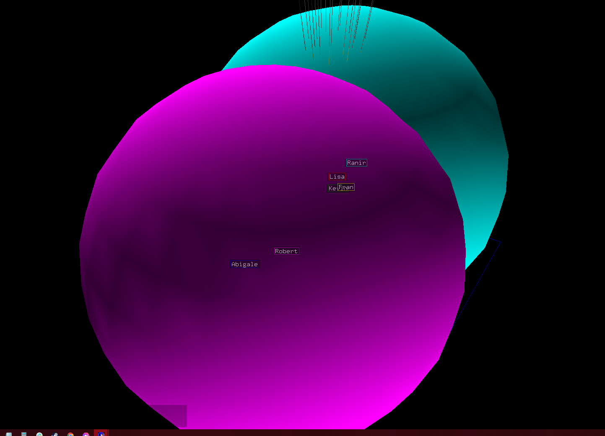
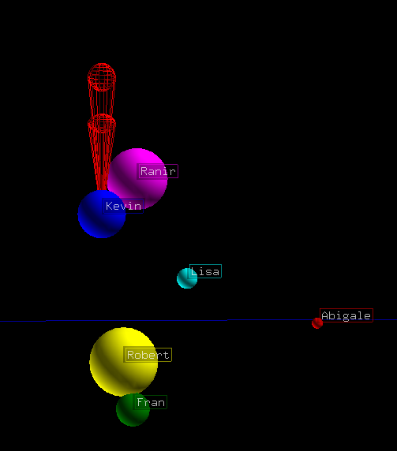
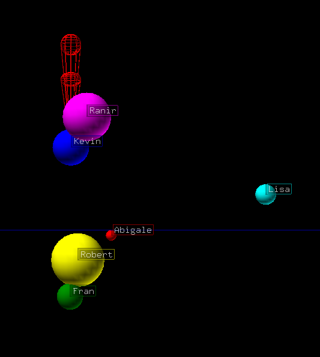
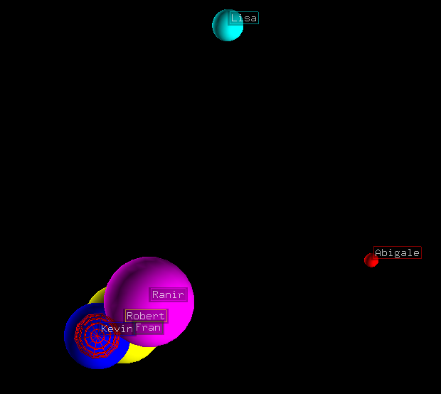

.. include:: ../.special.rst

Example 1
=========

First, import from required libraries

Import::

    import pandas as pd
    from matritools import nodefile as nf, utils as mu

Next, we can create some data, load it into a :variable:`pandas DataFrame` and establish a
:variable:`NodeFile`.

Create Data::

    my_data = {
    'Name'         : ['Kevin', 'Lisa', 'Ranir', 'Abigale', 'Robert', 'Fran'],
    'Height'       : [71, 64, 75, 59, 55, 50],
    'Weight'       : [184, 142, 209, 119, 220, 158],
    'Age'          : [26, 43, 31, 56, 29, 30],
    'Bank Balance' : [1.06, 3567.40, 300.00, 536.37, 126.57, -35.00]
    }

    df = pd.DataFrame(my_data)

    ntf = nf.NodeFile("Example 1")

Then, think about how you want to display data within Antz.

The easiest way to demonstrate the power of 3D is to use the :variable:`x, y, and z` position to
represent data values. We could also represent data values with :variable:`color`
and the :variable:`scale` of an object.

Lets plot some spheres. Each sphere will represent a person from our data.

First we use the :variable:`x coordinate` to represent the age of a person, the
:variable:`y coordinate` to represent the amount of money they have, and the
:variable:`z coordinate` to represent how tall they are.

Next we can represent how much they weigh by adjusting the :variable:`scale` of the person's sphere.

Lastly, we can distinguish what sphere belongs to which person by changing its :variable:`color`
and giving it a tag.

Lets iterate through our data with a for loop and create and modify nodes based on the data.

Creating Nodes::

    # create a dictionary mapping names of people to names of colors
    name_color_legend = mu.create_column_value_color_legend(df['Name'])

    for index, row in df.iterrows():

        name = row["Name"]

        # label your nodes with tags
        tag_text = 'Name: ' + name + \
                        ', H: ' + str(row['Height']) + \
                        ', W: ' + str(row['Weight']) + \
                        ', A: ' + str(row['Age']) + \
                        ', B: ' + str(row['Bank Balance'])

        # creates a new NodeFileRow and adds it to the NodeFile's node_file_rows
        # and sets its tag and tag mode
        node = ntf.create_node(None, tag_text, 1)

        # sets the color of a NodeFileRow
        node.set_color_by_name(name_color_legend[name])

        # change the geometry of this node to be a sphere
        node.geometry = nf.geos['sphere']

        # establish an x, y, and z coordinate based on scaled values of this person's height, weight, and age
        x_coordinate = row["Age"]
        y_coordinate = row["Bank Balance"]
        z_coordinate = row['Height']

        # set position of this node in 3D space
        node.set_translate(x_coordinate, y_coordinate, z_coordinate)

        # set the x, y, and z scale of the node uniformly
        node.set_u_scale((row['Weight']))

    # create csv file to use in Antz
    ntf.write_to_csv()

After running all of the above code, you should have two files named :filename:`"Example 1_node.csv"` and
:filename:`"Example 1_tag.csv"`. Load those into Antz

Uh oh...the nodes are too big or too close together. We can use :variable:`linear interpolation`
to scale the values of our data within a reasonable range. Luckily matritools has some utility
functions to do just that.

Create scalar functions::

    # make a reusable function that scales a value originally between the min and max height to be within 0, 10.
    # this is used to change all of the values of height to be within 0, 10 but keep the same relative distance between each
    # value

    height_scalar = mu.make_interpolator(min(my_data['Height']), max(my_data['Height']), 0, 10)

    weight_scalar = mu.make_interpolator(min(my_data['Weight']), max(my_data['Weight']), 0.25, 1.5)

    age_scalar = mu.make_interpolator(min(my_data['Age']), max(my_data['Age']), 0, 10)

    bank_scalar = mu.make_interpolator(min(my_data['Bank Balance']), max(my_data['Bank Balance']), 0, 10)

Now that we have scalar functions, lets see them in action.

Final Code::

    import pandas as pd
    from matritools import nodefile as nf, utils as mu

    my_data = {
        'Name'         : ['Kevin', 'Lisa', 'Ranir', 'Abigale', 'Robert', 'Fran'],
        'Height'       : [71, 64, 75, 59, 55, 50],
        'Weight'       : [184, 142, 209, 119, 220, 158],
        'Age'          : [26, 43, 31, 56, 29, 30],
        'Bank Balance' : [1.06, 3567.40, 300.00, 536.37, 126.57, -35.00]
    }

    df = pd.DataFrame(my_data)

    ntf = nf.NodeFile("Example 1")

    # make a reusable function that scales a value originally between the min and max height to be within 0, 10.
    # this is used to change all of the values of height to be within 0, 10 but keep the same relative distance between each
    # value
    height_scalar = mu.make_interpolator(min(my_data['Height']), max(my_data['Height']), 0, 10)
    weight_scalar = mu.make_interpolator(min(my_data['Weight']), max(my_data['Weight']), 0.25, 1.5)
    age_scalar = mu.make_interpolator(min(my_data['Age']), max(my_data['Age']), 0, 10)
    bank_scalar = mu.make_interpolator(min(my_data['Bank Balance']), max(my_data['Bank Balance']), 0, 10)

    # create a dictionary mapping names of people to names of colors
    name_color_legend = mu.create_column_value_color_legend(df['Name'])

    for index, row in df.iterrows():

        name = row["Name"]

        # label your nodes with tags
        tag_text = 'Name: ' + name + \
                        ', H: ' + str(row['Height']) + \
                        ', W: ' + str(row['Weight']) + \
                        ', A: ' + str(row['Age']) + \
                        ', B: ' + str(row['Bank Balance'])

        # creates a new NodeFileRow and adds it to the NodeFile's node_file_rows
        # and sets its tag and tag mode
        node = ntf.create_node(None, tag_text, 1)

        # sets the color of a NodeFileRow
        node.set_color_by_name(name_color_legend[name])

        # change the geometry of this node to be a sphere
        node.geometry = nf.geos['sphere']

        # establish an x, y, and z coorinate based on scaled values of this person's height, weight, and age
        x_coordinate = age_scalar(row["Age"])
        y_coordinate = bank_scalar(row["Bank Balance"])
        z_coordinate = height_scalar(row['Height'])

        # set position of this node in 3D space
        node.set_translate(x_coordinate, y_coordinate, z_coordinate)

        # set the x, y, and z scale of the node uniformly
        node.set_u_scale(weight_scalar(row['Weight']))

    # create csv file to use in Antz
    ntf.write_to_csv()

Now lets pop these into Antz and see the final result.

From the front, we can see, the farther right, the older the person is, and the father up,
the taller they are.

From the right side, we can see the the farther right, the more they have in their bank,
and the farther up, the taller they are.

From the top, we can see the farther right, the older the person is, and the farther up,
the more they have in their bank.

In all of the images you can see the scale of spheres change based on weight and the color base
on their name.

“A computer once beat me at chess, but it was no match for me at kick boxing.”
— Emo Philips