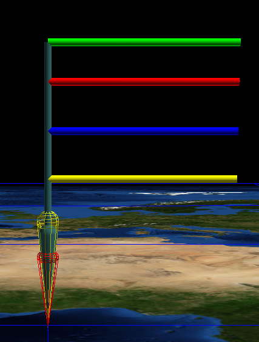

.. include:: ../.special.rst
Example 2
=========

First, import from required libraries

Import::

    import pandas as pd
    from matritools import nodefile as nf, utils as mu

Next, we can create some data, load it into a :variable:`pandas DataFrame` and establish a
:variable:`NodeFile`.

Create Data::

    my_data = {
    'Name'         : ['Kevin', 'Lisa', 'Ranir', 'Abigale', 'Robert', 'Fran'],
    'Height'       : [71, 64, 75, 59, 55, 50],
    'Weight'       : [184, 142, 209, 119, 220, 158],
    'Age'          : [26, 43, 31, 56, 29, 30],
    'Bank Balance' : [1.06, 3567.40, 300.00, 536.37, 126.57, -35.00]
    }

    df = pd.DataFrame(my_data)

    ntf = nf.NodeFile("Example 2")

Now lets create a glyph template inside of antz to represent data points of one person.

Let's make a simple 3D bar graph to show the data of each person.

Let us represent a data values by adjusting the :variable:`length` of each of the colored rods,
sticking out of the side.

Let the green rod represent :green:`height`, red represent :red:`weight`, blue represent :blue:`age`,
and yellow represent :yellow:`bank account balance`.

In order to use this template, we need to get the csv file created from saving our template in Antz
and place it in the same directory as our script. Lets name it :filename:`"Example_2_Template.csv"`.

Now, in order for us to change the :variable:`length` of our rods, we need to know which row in
:filename:`"Example_2_Template.csv"` is which rod.

When we create a glyph in antz and save it, two files are created, a node and a tag file.
Before we save our glyph we can add tags to individual pieces that we care about.

After labeling pieces and saving the glyph, in the same script or a separate one, we can call a function
that will tell us the index numbers of each node.

Finding indexes::

    from matritools import utils as mu

    mu.get_node_indexes('Example_2_Template.csv', 'Example_2_Template_tag.csv')

    # output:
    # 0 : root
    # 1 : record id: 21
    # 2 : weight rod
    # 3 : height_rod
    # 4 : bank_rod
    # 5 : age_rod

Knowing the indexes, we can save references to individual Node's in our code.

.. image:: Example_2_result.png

Define key nodes from your glyph::

    root = glyph.nodes[0]
    weight_rod = glyph.nodes[2]
    height_rod = glyph.nodes[3]
    bank_rod = glyph.nodes[4]
    age_rod = glyph.nodes[5]

.. note::
   In the context,
	a::

		glyph.nodes[0]

	is the same as ...

	b::

		glyph[0]

Now that we are familiar with our node file. Lets establish our :variable:`Glyph` object,
make some scalars and define how far apart we want to space our glyphs.

Set up :variable:`Glyph`, scalars and unit distance::

    glyph = nf.Glyph("Example_2_Glyph_Template.csv")

    # make a reusable function that scales a value originally between the min and max height to be within 0.1, 1.
    # this is used to change all of the values of height to be within 0.1, 1 but keep the same relative distance between
    # each value
    height_scalar = mu.make_interpolator(min(my_data['Height']), max(my_data['Height']), 0.1, 1)
    weight_scalar = mu.make_interpolator(min(my_data['Weight']), max(my_data['Weight']), 0.1, 1)
    age_scalar = mu.make_interpolator(min(my_data['Age']), max(my_data['Age']), 0.1, 1)
    bank_scalar = mu.make_interpolator(min(my_data['Bank Balance']), max(my_data['Bank Balance']), 0.1, 1)

    unit_distance = 20

Finally, lets iterate through the data and modify the glyph template each iteration.

Modify the glyph::

    for index, row in df.iterrows():

        # set the tag and tag mode of the root node
        root.set_tag(row["Name"], 1)

        # set x position
        root.translate_x = index * unit_distance

        # set weight rod length
        weight_rod.scale_z = weight_scalar(row['Weight'])

        # set height rod length
        height_rod.scale_z = height_scalar(row['Height'])

        # set bank rod length
        bank_rod.scale_z = bank_scalar(row['Bank Balance'])

        # set age rod length
        age_rod.scale_z = age_scalar(row['Age'])

        # set the tag and tag mode to display the un-interpolated value
        weight_rod.set_tag('Weight: ' + (row['Weight']), 8)
        height_rod.set_tag('Height: ' + str(row['Height']), 8)
        bank_rod.set_tag('Balance: ' + str(row['Bank Balance']), 8)
        age_rod.set_tag('Age: ' + str(row['Age']), 8)

        # add all Nodes of glyph to the NodeFile and increment all of the IDs of the glyph
        ntf.add_glyph(glyph)

    # create csv file to use in Antz
    ntf.write_to_csv()

Final Code::

    import pandas as pd
    from matritools import nodefile as nf, utils as mu

    my_data = {
        'Name'         : ['Kevin', 'Lisa', 'Ranir', 'Abigale', 'Robert', 'Fran'],
        'Height'       : [71, 64, 75, 59, 55, 50],
        'Weight'       : [184, 142, 209, 119, 220, 158],
        'Age'          : [26, 43, 31, 56, 29, 30],
        'Bank Balance' : [1.06, 3567.40, 300.00, 536.37, 126.57, -35.00]
    }

    df = pd.DataFrame(my_data)

    ntf = nf.NodeFile("Example 2")

    glyph = nf.Glyph("Example_2_Glyph_Template.csv")

    # make a reusable function that scales a value originally between the min and max height to be within 0.1, 1.
    # this is used to change all of the values of height to be within 0.1, 1 but keep the same relative distance between
    # each value
    height_scalar = mu.make_interpolator(min(my_data['Height']), max(my_data['Height']), 0.1, 1)
    weight_scalar = mu.make_interpolator(min(my_data['Weight']), max(my_data['Weight']), 0.1, 1)
    age_scalar = mu.make_interpolator(min(my_data['Age']), max(my_data['Age']), 0.1, 1)
    bank_scalar = mu.make_interpolator(min(my_data['Bank Balance']), max(my_data['Bank Balance']), 0.1, 1)

    # used to space glyphs apart
    unit_distance = 20

    # define key nodes from your glyph
    root = glyph.nodes[0]
    weight_rod = glyph.nodes[2]
    height_rod = glyph.nodes[3]
    bank_rod = glyph.nodes[4]
    age_rod = glyph.nodes[5]

    for index, row in df.iterrows():

        # set the tag and tag mode of the root node
        root.set_tag(row["Name"], 1)

        # set x position
        root.translate_x = index * unit_distance

        # set weight rod length
        weight_rod.scale_z = weight_scalar(row['Weight'])

        # set height rod length
        height_rod.scale_z = height_scalar(row['Height'])

        # set bank rod length
        bank_rod.scale_z = bank_scalar(row['Bank Balance'])

        # set age rod length
        age_rod.scale_z = age_scalar(row['Age'])

        # set the tag and tag mode to display the un-interpolated value
        weight_rod.set_tag('Weight: ' + (row['Weight']), 8)
        height_rod.set_tag('Height: ' + str(row['Height']), 8)
        bank_rod.set_tag('Balance: ' + str(row['Bank Balance']), 8)
        age_rod.set_tag('Age: ' + str(row['Age']), 8)

        # add all Nodes of glyph to the NodeFile and increment all of the IDs of the glyph
        ntf.add_glyph(glyph)

    # create csv file to use in Antz
    ntf.write_to_csv()

Final Result:

.. image:: Example_2_result.png

“Standards are always out of date.  That’s what makes them standards.”
— Alan Bennett