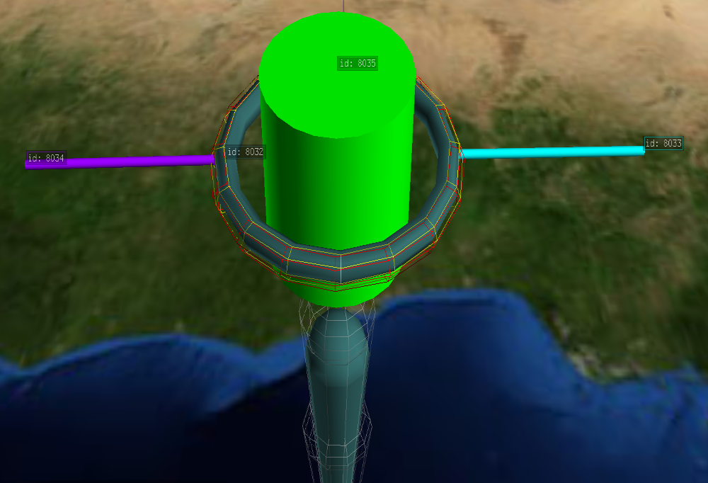
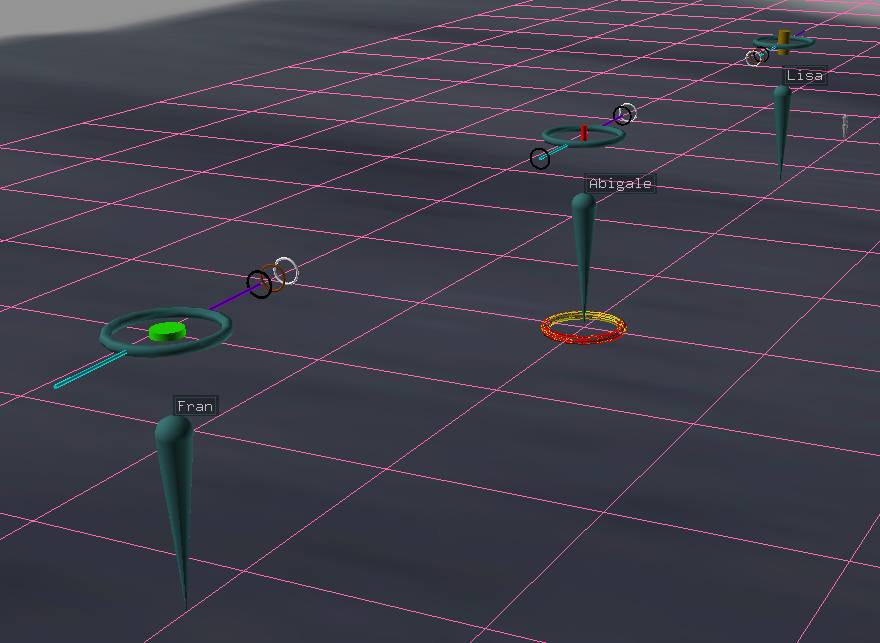
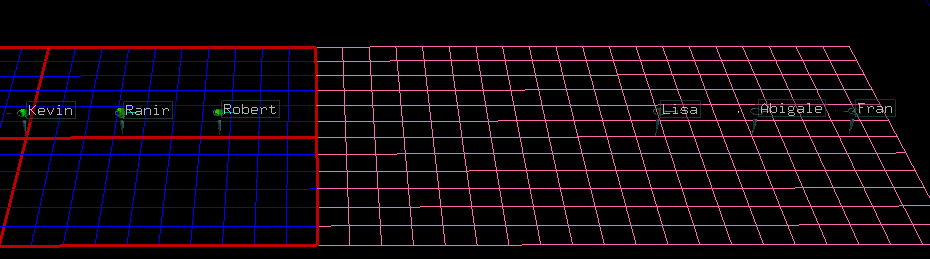

.. include:: ../.special.rst
Example 3
=========

First, import from required libraries

Import::

    import pandas as pd
    import copy
    import matrtiools as mt

Next, we can create some data, load it into a :variable:`pandas DataFrame` and establish a
:variable:`NodeFile`.

Create Data::

    my_data = {
    'Name'     : ['Kevin',              'Lisa', 'Ranir',     'Abigale', 'Robert',              'Fran'],
    'Sex'      : [    'M',                 'F',     'M',           'F',      'M',                 'F'],
    'Height'   : [     71,                  64,      75,            59,       55,                  50],
    'Weight'   : [    184,                 142,     209,           119,      220,                 158],
    'Age'      : [     26,                  43,      31,            56,       29,                  30],
    'CatColors': [   'na', 'black,brown,white',    'na',       'black', 'orange',                'na'],
    'DogColors': [   'na',                'na', 'brown', 'black,white',   'grey', 'black,brown,white']
    }

    df = pd.DataFrame(my_data)

    ntf = mt.NodeFile("Example 3")

Now lets create a glyph template inside of antz to represent data points of one person.

Let's make a simple 3D bar graph to show the data of each person.

Let us represent a data values by adjusting the :variable:`scale` of each of the cylinder in the middle.

Let the :variable:`height` or :variable:`scale_z` represent the :variable:`height`, and :variable:`scale_x`
and :variable:`scale_y` represent :variable:`weight` and finally, let the :variable:`color` represent age.

Each person has a number of cats and or dogs, given by how many colors were list of their cats or dogs.
Lets represent each cat or dog and their color by adding a colored rings to the rods sticking out of the side.
Let the :cyan:`cyan` rod be for cats, and the :purple:`purple` rod be for dogs.

Lastly, lets separate our people based on sex. We can parent the glyph to 1 of two grids, a blue and pink one,
and place the grids side by side.

In order to use this template, we need to get the csv file created from saving our template in Antz
and place it in the same directory as our script. Lets name it :filename:`"Example_3_Template.csv"`.

Now, in order for us to modify our :variable:`glyph`, we need to know which row in
:filename:`"Example_3_Template.csv"` is which part of the glyph.

When we create a glyph in antz and save it, two files are created, a node and a tag file.
Before we save our glyph we can add tags to individual pieces that we care about.

After labeling pieces and saving the glyph, in the same script or a separate one, we can call a function
that will tell us the index numbers of each node.

Finding indexes::

    import matritools as mt

    mt.get_node_indexes('Example_2_Template.csv', 'Example_2_Template_tag.csv')

    # output:
    # 0 : root
    # 1 : record id: 21
    # 2 : cat_rod
    # 3 : dog_rod
    # 4 : height weight age cylinder

Knowing the indexes, we can save references to individual Node's in our code.

Define key nodes from your glyph and modify properties that will remain constant::

    root = glyph.nodes[0]
    cat_rod = glyph.nodes[2]
    dog_rod = glyph.nodes[3]
    height_weight_age_cylinder = glyph.nodes[4]

    # set properties of glyph that will remain constant
    root.set_u_scale(4)

Now that we are familiar with our node file. Lets establish our :variable:`Glyph` object,
make some scalars and define how far apart we want to space our glyphs.

Set up :variable:`Glyph`, scalars and unit distance::

    glyph = mt.Glyph("Example_3_Glyph_Template.csv")

    # make a reusable function that scales a value originally between the min and max height to be within 0.1, 1.
    # this is used to change all of the values of height to be within 0.1, 1 but keep the same relative distance between
    # each value
    height_cylinder_z_scalar = mt.make_df_column_interpolator(df['Height'], 0.1, 1)
    weight_cylinder_xy_scalar = mt.make_df_column_interpolator(df['Weight'], 0.1, 1)
    age_cylinder_color_scalar = mt.make_df_column_interpolator(df['Age'], 0, 127)

    # used to space glyphs apart
    unit_distance = 50
    cat_dog_ring_distance = 50

Now, lets set up our grids::

    # build male grid

    # create_node() returns an instance of a Node and adds it to the NodeFile
    male_grid = ntf.create_node(None, 'Male Grid')
    male_grid.geometry = mt.geos["plane"]

    # when adding Nodes manually to a NodeFile, we must manage the ID's
    # to avoid having duplicate ID's in our NodeFile
    male_grid.set_id(ntf.get_last_node().id + 1)
    male_grid.set_color_by_name("blue")
    male_grid.set_translate(-75)
    male_grid.set_scale(0.25, 0.25, 0.25)

    # type 6 makes it a grid
    male_grid.type = 6

    # build female grid

    female_grid = ntf.create_node(template=male_grid)
    female_grid.set_color_by_name('hot pink')
    female_grid.set_translate(75)

Instead of modifying everything inside of the main loop, lets write functions to organize our work.::

    # declare helper functions for organization

    def modify_root(index, row):
        # set the tag and tag mode of the root Node
        root.set_tag(row["Name"], 1)

        # set x position
        root.translate_x = index * unit_distance

        # set parent id to be the id of the respective grid
        root.parent_id = male_grid.id if row['Sex'] == 'M' else female_grid.id

    def modify_height_weight_age_cylinder(row):
        # set cylinder scale
        x = y = weight_cylinder_xy_scalar(row['Weight'])
        z = height_cylinder_z_scalar(row['Height'])
        height_weight_age_cylinder.set_scale(x, y, z)

        # if a Node's color_r, color_g, color_b all are set to 0
        # its color is determined by its palette_id, and its color_id

        # a Node's color_id maps to a color relative to its palette_id
        # for exampe, palette_id 0 maps color_id 1 to lime green, 2 to red, and 3 to blue
        # while palette_id 6 maps 1 - 127 to be colors on a spectrum from green to red

        # set the color_id to display a color on a spectrum relative to its palette_id
        height_weight_age_cylinder.set_color_by_id(age_cylinder_color_scalar(row['Age'], 6)

        # set the tag and tag mode to display the un-interpolated value
        height_weight_age_cylinder.set_tag('Weight: ' + str(row['Weight']) +
                                           ', Height: ' + str(row['Height']) +
                                           ', Age: ' + str(row['Age']))

    def modify_rod(rod, data_value):
        # skip function if value is na
        if data_value == 'na':
            return

        # split the string of colors by ',' to get a list of strings
        colors = data_value.split(',')

        # create a ring for each cat or dog color in the list
        for i in range(len(colors)):

            # by default, Nodes are toroids
            ring = glyph.create_temp_node(rod, data_value)

            # set position of ring on rod
            ring.translate_x = i * cat_dog_ring_distance

            # set color of toroid based on color value
            ring.set_color_by_name(colors[i])

Finally, lets iterate through the data and call our functions each iteration and be sure to clean up any
unwanted changes to our glyph.

Modify the glyph::

    for index, row in df.iterrows():

        # call helper functions to modify the glyph template
        modify_root(index, row)
        modify_height_weight_age_cylinder(row)
        modify_rod(cat_rod, row['CatColors'])
        modify_rod(dog_rod, row['DogColors'])

        # add copies of all Nodes from glyph to NodeFile
        ntf.add_glyph(glyph)

    # create csv file to use in Antz
    ntf.write_to_csv()

Final Code::

    import pandas as pd
    import copy
    import matritools as mt

    my_data = {
        'Name'     : ['Kevin',              'Lisa', 'Ranir',     'Abigale', 'Robert',              'Fran'],
        'Sex'      : [    'M',                 'F',     'M',           'F',      'M',                 'F'],
        'Height'   : [     71,                  64,      75,            59,       55,                  50],
        'Weight'   : [    184,                 142,     209,           119,      220,                 158],
        'Age'      : [     26,                  43,      31,            56,       29,                  30],
        'CatColors': [   'na', 'black,brown,white',    'na',       'black', 'orange',                'na'],
        'DogColors': [   'na',                'na', 'brown', 'black,white',   'grey', 'black,brown,white']
    }

    df = pd.DataFrame(my_data)

    ntf = mt.NodeFile("Example 3")

    glyph = mt.Glyph("Example_3_Glyph_Template.csv")

    # make a reusable function that scales a value originally between the min and max height to be within 0.1, 1.
    # this is used to change all of the values of height to be within 0.1, 1 but keep the same relative distance between
    # each value
    height_cylinder_z_scalar = mt.make_df_column_interpolator(df['Height'], 0.1, 1)
    weight_cylinder_xy_scalar = mt.make_df_column_interpolator(df['Weight'], 0.1, 1)
    age_cylinder_color_scalar = mt.make_df_column_interpolator(df['Age'], 0, 127)

    # used to space glyphs apart
    unit_distance = 50
    cat_dog_ring_distance = 50

    # build male grid

    # create_node() returns an instance of a Node and adds it to the NodeFile
    male_grid = ntf.create_node()
    male_grid.geometry = mt.geos["plane"]
    male_grid.set_color_by_name("blue")
    male_grid.set_translate(-75)
    male_grid.set_scale(0.25, 0.25, 0.25)

    # type 6 makes it a grid
    male_grid.type = 6

    # build female grid

    female_grid = ntf.create_node(template=male_grid)
    female_grid.set_color_by_name('hot pink')
    female_grid.set_translate(75)

    # define key nodes from your glyph
    root = glyph.nodes[0]
    cat_rod = glyph.nodes[2]
    dog_rod = glyph.nodes[3]
    height_weight_age_cylinder = glyph.nodes[4]

    # set properties of glyph that will remain constant
    root.set_u_scale(4)

    # declare helper functions for organization

    def modify_root(index, row):
        # set the tag and tag mode of the root Node
        root.set_tag(row["Name"], 1)

        # set x position
        root.translate_x = index * unit_distance

        # set parent id to be the id of the respective grid
        root.parent_id = male_grid.id if row['Sex'] == 'M' else female_grid.id

    def modify_height_weight_age_cylinder(row):
        # set cylinder scale
        x = y = weight_cylinder_xy_scalar(row['Weight'])
        z = height_cylinder_z_scalar(row['Height'])
        height_weight_age_cylinder.set_scale(x, y, z)

        # if a Node's color_r, color_g, color_b all are set to 0
        # its color is determined by its palette_id, and its color_id

        # a Node's color_id maps to a color relative to its palette_id
        # for exampe, palette_id 0 maps color_id 1 to lime green, 2 to red, and 3 to blue
        # while palette_id 6 maps 1 - 127 to be colors on a spectrum from green to red

        # set the color_id to display a color on a spectrum relative to its palette_id
        height_weight_age_cylinder.set_color_by_id(age_cylinder_color_scalar(row['Age'], 6)

        # set the tag and tag mode to display the un-interpolated value
        height_weight_age_cylinder.set_tag('Weight: ' + str(row['Weight']) +
                                           ', Height: ' + str(row['Height']) +
                                           ', Age: ' + str(row['Age']))

    def modify_rod(rod, data_value):
        # skip function if value is na
        if data_value == 'na':
            return

        # split the string of colors by ',' to get a list of strings
        colors = data_value.split(',')

        # create a ring for each cat or dog color in the list
        for i in range(len(colors)):

            # by default, Nodes are toroids
            ring = glyph.create_temp_node(rod, data_value)

            # set position of ring on rod
            ring.translate_x = i * cat_dog_ring_distance

            # set color of toroid based on color value
            ring.set_color_by_name(colors[i])

    for index, row in df.iterrows():

        # call helper functions to modify the glyph template
        modify_root(index, row)
        modify_height_weight_age_cylinder(row)
        modify_rod(cat_rod, row['CatColors'])
        modify_rod(dog_rod, row['DogColors'])

        # add copies of all Nodes from glyph to NodeFile
        ntf.add_glyph(glyph)

    # create csv file to use in Antz
    ntf.write_to_csv()

Final Result:

“It’s hardware that makes a machine fast.  It’s software that makes a fast machine slow.”
— Craig Bruce