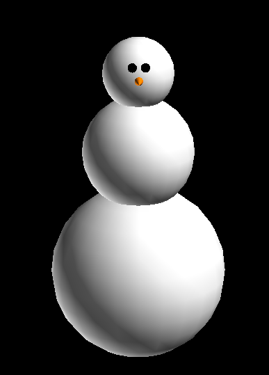
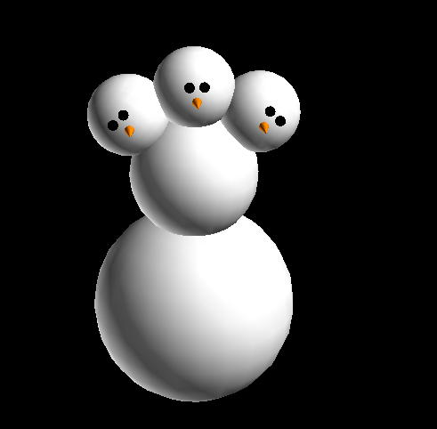

.. include:: ../.special.rst

Example 4
=========

Do you want to snow man?
------------------------

Import::

    import matritools as mt

Next, we initialize a NodeFile and an empty Glyph

Initialize Classes::

	ntf = mt.NodeFile('snowman')

	glyph = mt.Glyph()

Let's create a lower body and use it as our root node.

Lower Body::

	lower_body = glyph.create_node()
	lower_body.set_color_by_name('white')
	lower_body.geometry = mt.geos['sphere']
	lower_body.topo = mt.topos['sphere']
	lower_body.set_u_scale(3)

And now for the upper body using the lower body as a template

Upper Body::

	upper_body = glyph.create_node(lower_body, template=lower_body)
	upper_body.set_u_scale(2.5)

	# Moves the head along the surface of the sphere topology until we get to the top.
	upper_body.translate_y = 90

	# Lowers the upper body to slightly overlap with lower_body
	upper_body.translate_z = -50

Next, we can make the head

Head::

	head = glyph.create_node(template=body)

Let's add some eyes.

Eyes::

	eye1 = glyph.create_node(head, template=head)
	eye1.set_u_scale(0.5)
	eye1.set_color_by_name('black')
	eye1.set_translate(-10, 160, -10)

	eye2 = glyph.create_node(head, template=eye1)
	eye2.translate_x = 10

Last, but not least, a nose.

Nose::

	nose = head_glyph.create_node(head)
	nose.set_color_by_name('orange')
	nose.geometry = mt.geos['cone']
	nose.set_translate(0, 180)
	nose.set_scale(0.5, 0.5, 1)

Of course we need to add the glyph to the node file and write the csv.

Write File::

	ntf.add_glyph(body_glyph)

	ntf.write_to_csv()

But what if we wanted to make a three headed snowman?

We can refactor our code so that the head is its own glyph and essentially copy and paste the head.

Instead of::

	head = glyph.create_node(template=body)

Let's do::

	head_glyph = mt.Glyph()

	head = head_glyph.create_node(template=upper_body)

For the eyes and nose lets replace glyph with head_glyph::

	eye1 = head_glyph.create_node(head, template=head)
	eye1.set_u_scale(0.5)
	eye1.set_color_by_name('black')
	eye1.set_translate(-10, 160, -10)

	eye2 = head_glyph.create_node(head, template=eye1)
	eye2.translate_x = 10

	nose = head_glyph.create_node(head)
	nose.set_color_by_name('orange')
	nose.geometry = mt.geos['cone']
	nose.set_translate(0, 180)
	nose.set_scale(0.5, 0.5, 1)

Now we can append head_glyph to glyph as a child using add_glyph()

Append child glyph::

	glyph.add_glyph(head_glyph, upper_body.id)

Now we can modify the head glyph to appear slightly to the left or right and add it our base glyph

Copy, Paste, Adjust::

	head.set_translate(90, 45, -50)
	head.rotate_y = 90
	glyph.add_glyph(head_glyph, upper_body.id)

Do it again, but slightly to the left::

	head.set_translate(-90, 45, -50)
	head.rotate_y = -90
	glyph.add_glyph(head_glyph, upper_body.id)

Final Code::

	import matritools as mt

	ntf = mt.NodeFile('snowman')

	# base glyph
	glyph = mt.Glyph()

	lower_body = glyph.create_node()
	lower_body.set_color_by_name('white')
	lower_body.geometry = mt.geos['sphere']
	lower_body.topo = mt.topos['sphere']
	lower_body.set_u_scale(3)

	upper_body = glyph.create_node(lower_body, template=lower_body)
	upper_body.set_u_scale(2.5)

	# Moves the head along the surface of the sphere topology until we get to the top.
	upper_body.translate_y = 90

	# Lowers the upper body to slightly overlap with lower_body
	upper_body.translate_z = -50

	# head glyph
	head_glyph = mt.Glyph()

	head = head_glyph.create_node(template=upper_body)

	eye1 = head_glyph.create_node(head, template=head)
	eye1.set_u_scale(0.5)
	eye1.set_color_by_name('black')
	eye1.set_translate(-10, 160, -10)

	eye2 = head_glyph.create_node(head, template=eye1)
	eye2.translate_x = 10

	nose = head_glyph.create_node(head)
	nose.set_color_by_name('orange')
	nose.geometry = mt.geos['cone']
	nose.set_translate(0, 180)
	nose.set_scale(0.5, 0.5, 1)

	# add head 1
	glyph.add_glyph(head_glyph, upper_body.id)

	# add head 2
	head.set_translate(90, 45, -50)
	head.rotate_y = 90
	glyph.add_glyph(head_glyph, upper_body.id)

	# add head 3
	head.set_translate(-90, 45, -50)
	head.rotate_y = -90
	glyph.add_glyph(head_glyph, upper_body.id)

	ntf.add_glyph(glyph)

	ntf.write_to_csv()

Is this tutorial just for fun? Not exactly. Let's discuss a practical application.

First, adding glyphs to glyphs doesn't just apply to glyphs made entirly in code.
You can recall from previous examples that glyphs can be made from node csv files and there may be times where you want to combine two files.
If you have a suite of glyphs that are almost the same but differ by one or more pieces, you could separate the pieces that change into seperate glyphs.
This way changes to the base glyph don't need to be reapplied to all of its copies.
We can call this modular glyph building.

“A program is never less than 90% complete, and never more than 95% complete.”— Terry Baker