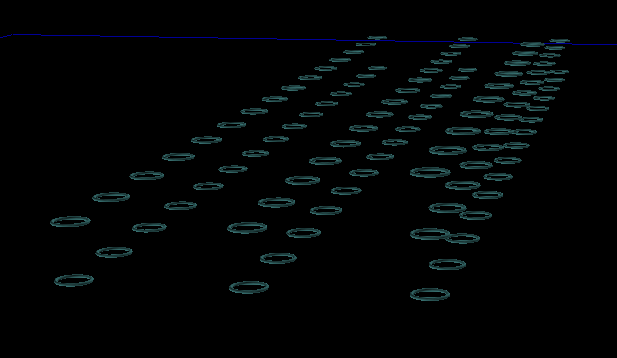

place_node
----------

Positions a node and increments internal indexes.

Parameters:

+-------------+---------------------------------------------------------+----------------------+-----------+
| Name        | Description                                                           | Type   | Default   |
+=============+=======================================================================+========+===========+
| x_distance  | distance each node will be away from each other on the x axis         | float  | 8         |
+-------------+-----------------------------------------------------------------------+--------+-----------+
| y_distance  | distance each node will be away from each other on the y axis         | float  |           |
+-------------+-----------------------------------------------------------------------+--------+-----------+
| x_offset    | starting position of the grid on the x axis                           | float  | 8         |
+-------------+-----------------------------------------------------------------------+--------+-----------+
| y_offset    | starting position of the grid on the y axis                           | float  | 0         |
+-------------+-----------------------------------------------------------------------+--------+-----------+
| max_rows    | the number of nodes placed on the x axis before moving on the y axis. | int    | 0         |
+-------------+-----------------------------------------------------------------------+--------+-----------+
| max_columns | the number of nodes placed on the y axis before moving on the z axis. | int    | 0         |
|             | Set to 0 for unlmited columns                                         |        |           |
+-------------+-----------------------------------------------------------------------+--------+-----------+
| z_distance  | distance each node will be away from each other on the z axis         | float  | 0         |
+-------------+-----------------------------------------------------------------------+--------+-----------+
| z_offset    | starting position of the grid on the z axis                           | float  | 0         |
+-------------+-----------------------------------------------------------------------+--------+-----------+

Raises:
    TypeError

Example Default Parameters::

	import matritools as mt

	ntf = mt.NodeFile(file_name)

	grid_pattern = mt.GridPattern()

	for i in range(100):
		grid_pattern.place_node(ntf.create_node())

	ntf.write_to_csv()

Example x_distance::

	import matritools as mt

	ntf = mt.NodeFile(file_name)

	grid_pattern = mt.GridPattern(10)

	for i in range(100):
		grid_pattern.place_node(ntf.create_node())

	ntf.write_to_csv()

Example y_distance::

	import matritools as mt

	ntf = mt.NodeFile(file_name)

	grid_pattern = mt.GridPattern(10, 15)

	for i in range(100):
		grid_pattern.place_node(ntf.create_node())

	ntf.write_to_csv()

Example x_offset::

	import matritools as mt

	ntf = mt.NodeFile(file_name)

	grid_pattern = mt.GridPattern(10, 15, 0)

	for i in range(100):
		grid_pattern.place_node(ntf.create_node())

	ntf.write_to_csv()

Example y_offset::

	import matritools as mt

	ntf = mt.NodeFile(file_name)

	grid_pattern = mt.GridPattern(10, 15, 0, 0)

	for i in range(100):
		grid_pattern.place_node(ntf.create_node())

	ntf.write_to_csv()

Example max_rows::

	import matritools as mt

	ntf = mt.NodeFile(file_name)

	grid_pattern = mt.GridPattern(10, 15, 0, 0, 15)

	for i in range(100):
		grid_pattern.place_node(ntf.create_node())

	ntf.write_to_csv()

.. image:: grid_patter_6.png

Example max_columns::

	import matritools as mt

	ntf = mt.NodeFile(file_name)

	grid_pattern = mt.GridPattern(10, 15, 0, 0, 15, 3)

	for i in range(100):
		grid_pattern.place_node(ntf.create_node())

	ntf.write_to_csv()

Example z_distance::

	import matritools as mt

	ntf = mt.NodeFile(file_name)

	grid_pattern = mt.GridPattern(10, 15, 0, 0, 15, 3, 1)

	for i in range(100):
		grid_pattern.place_node(ntf.create_node())

	ntf.write_to_csv()

Example z_offset::

	import matritools as mt

	ntf = mt.NodeFile(file_name)

	grid_pattern = mt.GridPattern(10, 15, 0, 0, 15, 3, 1, 10)

	for i in range(100):
		grid_pattern.place_node(ntf.create_node())

	ntf.write_to_csv()

