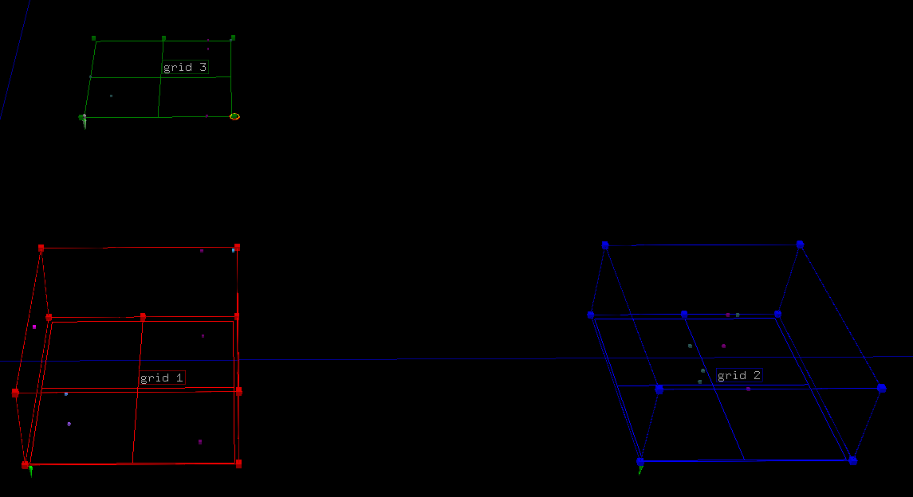

multi_scatter_plot
------------------
Adds a scatter plot to a NodeFile per row in an input_df. input_df should contain most of the
parameters to call scatter_plot. input_df must contain column names of data_df.
Translates grids to form a grid pattern. Returns a list of tuples containg grid_handles and grids.

Parameters:

+---------------+------------------------------------------------------+-------------------------------+---------+
| Name          | Description                                          | Type                          | Default |
+===============+======================================================+===============================+=========+
| data_df       | DataFrame to plot points from.                       | DataFrame                     | N/A     |
+---------------+------------------------------------------------------+-------------------------------+---------+
| input_df      | DataFrame containing rows with column names from     |                               |         |
|               | data_df and parameters for scatter_plot_merge_plots. |                               |         |
|               | DataFrame should have the following column names:    |                               |         |
|			    | grid_color, x_column,	y_column, z_column,            |                               |         |
|        		| color_column, common_tag,	x_min, x_max, y_min,       |                               |         |
|               | y_max, z_min,	z_max, color_min, color_max. Use       |                               |         |
|               | generate_multi_scatter_plot_input_csv to generate a  |                               |         |
|               | template csv                                         | DataFrame                     | N/A     |
+---------------+------------------------------------------------------+-------------------------------+---------+
| ntf           | NodeFile to add grid and plots too.                  | NodeFile                      | N/A     |
+---------------+------------------------------------------------------+-------------------------------+---------+
| key_column    | Column name used to uniquley identify each row.      |                               |         |
|               | The data in this column will be used in tags.        |                               |         |
|               | Can be None.                                         | str                           | N/A     |
+---------------+------------------------------------------------------+-------------------------------+---------+

Returns:
    list[tuple(Node, Node)]

Raises:
    TypeError

Example::

	import matritools as mt
	import pandas as pd

	data = {"Name": ["Plot 1", "Plot 2", "Plot 3", "Plot 4", "Plot 5", "Plot 6", "Plot 7"],
			"A": [1, 6, 2, 6, 7, 2, 6],
			"B": [4, 7, 2, 8, 8, 2, 0],
			"C": [8, 2, 5, 9, 9, 2, 4],
			"D": [8, 6, 3, 1, 2, 5, 0]}

	data_df = pd.DataFrame(data)

	input_data = {'grid_color': ['red', 'blue', 'green'],
				  'x_column': ["A", "A", "A"],
				  'y_column': ["B", "B", "B"],
				  'z_column': ["C", "C", ""],
				  'color_column': ["D", "", ""],
				  'common_tag': ['A/B/C/D', 'A/B/C/D', 'A/B'],
				  'x_min': ['', '-5', ''],
				  'x_max': ['', '15', ''],
				  'y_min': ['', '-5', ''],
				  'y_max': ['', '15', ''],
				  'z_min': ['', '-5', ''],
				  'z_max': ['', '15', ''],
				  'color_min': ['', '-5', ''],
				  'color_max': ['', '15', '']}

	input_df = pd.DataFrame(input_data)

	file_name = "my_file_name"

	ntf = mt.NodeFile(file_name)

	mt.scatter_plot_template.geometry = mt.geos['cube']
	mt.set_scatter_color_info(palette_id_in=7)

	def my_node_function(node, row):
		if row["A"] == 6:
			node.set_color_by_name('purple')

	grid_nodes = mt.multi_scatter_plot(data_df, input_df, ntf, "Name", my_node_function)

	for index, grid_tuple in enumerate(grid_nodes):
		grid_handle, grid = grid_tuple
		grid.set_tag(f'grid {index + 1}', 1)
		grid_handle.set_color_by_name('lime')

	ntf.write_to_csv()

