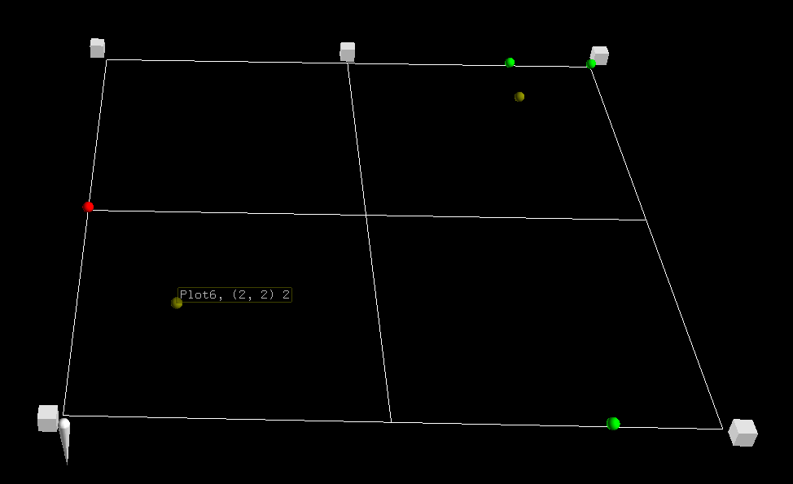
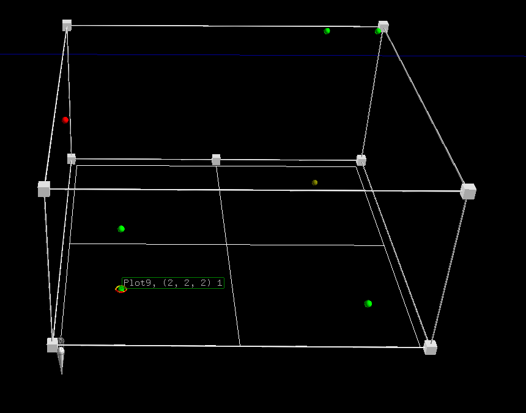
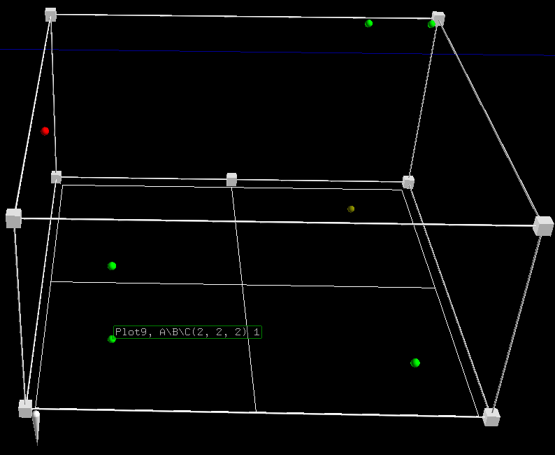
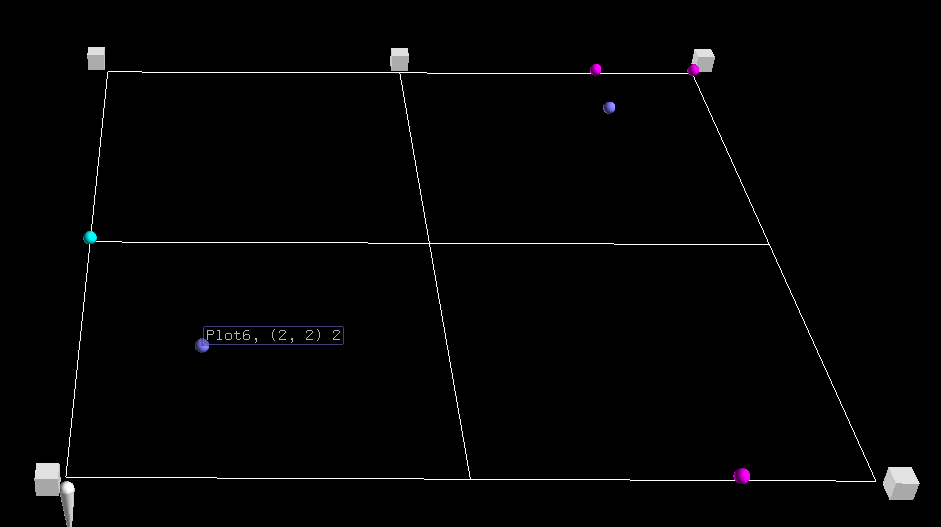
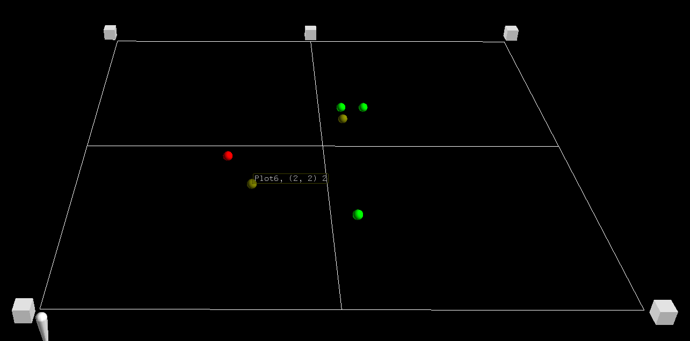
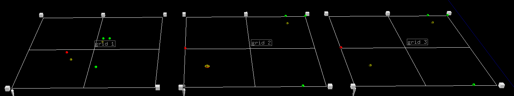

scatter_plot_merge_plots
------------------------
Adds a grid with a grid handle with points plotted from a DataFrame to a NodeFile.

Parameters:

+---------------+------------------------------------------------------+-------------------------------+---------+
| Name          | Description                                          | Type                          | Default |
+===============+======================================================+===============================+=========+
| df            | DataFrame to plot points from.                       | DataFrame                     | N/A     |
+---------------+------------------------------------------------------+-------------------------------+---------+
| ntf           | NodeFile to add grid and plots too.                  | NodeFile                      | N/A     |
+---------------+------------------------------------------------------+-------------------------------+---------+
| grid_color    | Color of grid lines. Key from nodefileglobals.colors | bool                          | N/A     |
+---------------+------------------------------------------------------+-------------------------------+---------+
| key_column    | Column name used to uniquley identify each row.      |                               |         |
|               | The data in this column will be used in tags.        |                               |         |
|               | Can be None.                                         | str                           | N/A     |
+---------------+------------------------------------------------------+-------------------------------+---------+
| x_column      | Column name for data that is interpolated to place a |                               |         |
|               | plot along the x axis.                               | str                           | N/A     |
+---------------+------------------------------------------------------+-------------------------------+---------+
| y_column      | Column name for data that is interpolated to place a |                               |         |
|               | plot along the y axis.                               | str                           | N/A     |
+---------------+------------------------------------------------------+-------------------------------+---------+
| z_column      | Column name for data that is interpolated to place a |                               |         |
|               | plot along the z axis.                               | str                           | None    |
+---------------+------------------------------------------------------+-------------------------------+---------+
| common_tag    | A string that will be added to every plots tag. Tag  |                               |         |
|               | for each plot will be formmated as key_column + ", " |                               |         |
|               |  + common_tag + '(' + x_column + ", " + y_column +   |                               |         |
|               | ") " + number of merged points.                      | str                           | ""      |
+---------------+------------------------------------------------------+-------------------------------+---------+

Returns:
    tuple(Node, Node)

Raises:
    TypeError

Basic usage (2D scatter plot)::

	import matritools as mt
	import pandas as pd

	plots = {"Name": ["Plot 1", "Plot 2", "Plot 3", "Plot 4", "Plot 5", "Plot 6", "Plot 7"],
			 "A": [1, 6, 2, 6, 7, 2, 6],
			 "B": [4, 7, 2, 8, 8, 2, 0],
			 "C": [8, 2, 5, 9, 9, 2, 4],
			 "D": [8, 6, 3, 1, 2, 5, 0]}

	df = pd.DataFrame(plots)

	file_name = "my_file_name"

	ntf = mt.NodeFile(file_name)

	mt.scatter_plot_merge_plots(df, ntf, 'white', 'Name', 'A', 'B')

	ntf.write_to_csv()

Basic usage (3D scatter plot)::

	import matritools as mt
	import pandas as pd

	plots = {"Name": ["Plot1", "Plot2", "Plot3", "Plot4", "Plot5", "Plot6", "Plot7", "Plot8", "Plot9", "Plot10"],
		 "A": [1, 1, 1, 6, 6, 2, 6, 7, 2, 6],
		 "B": [4, 4, 4, 7, 7, 2, 8, 8, 2, 0],
		 "C": [8, 8, 8, 2, 2, 5, 9, 9, 2, 4],
		 "D": [8, 8, 8, 6, 6, 3, 1, 2, 5, 0]}

	df = pd.DataFrame(plots)

	file_name = "my_file_name"

	ntf = mt.NodeFile(file_name)

	mt.scatter_plot_merge_plots(df, ntf, 'white', 'Name', 'A', 'B', 'C')

	ntf.write_to_csv()

Basic Usage (3D scatter plot)::

	import matritools as mt
	import pandas as pd

	plots = {"Name": ["Plot1", "Plot2", "Plot3", "Plot4", "Plot5", "Plot6", "Plot7", "Plot8", "Plot9", "Plot10"],
		 "A": [1, 1, 1, 6, 6, 2, 6, 7, 2, 6],
		 "B": [4, 4, 4, 7, 7, 2, 8, 8, 2, 0],
		 "C": [8, 8, 8, 2, 2, 5, 9, 9, 2, 4],
		 "D": [8, 8, 8, 6, 6, 3, 1, 2, 5, 0]}

	df = pd.DataFrame(plots)

	file_name = "my_file_name"

	ntf = mt.NodeFile(file_name)

	mt.scatter_plot_merge_plots(df, ntf, 'white', 'Name', 'A', 'B', 'C', "A\B\C")

	ntf.write_to_csv()

Advanced Usage (2D scatter plot)::

	import matritools as mt
	import pandas as pd

	plots = {"Name": ["Plot1", "Plot2", "Plot3", "Plot4", "Plot5", "Plot6", "Plot7", "Plot8", "Plot9", "Plot10"],
		 "A": [1, 1, 1, 6, 6, 2, 6, 7, 2, 6],
		 "B": [4, 4, 4, 7, 7, 2, 8, 8, 2, 0],
		 "C": [8, 8, 8, 2, 2, 5, 9, 9, 2, 4],
		 "D": [8, 8, 8, 6, 6, 3, 1, 2, 5, 0]}

	df = pd.DataFrame(plots)

	file_name = "my_file_name"

	ntf = mt.NodeFile(file_name)

	# edit pallete_id before plotting
	mt.set_scatter_color_info(palette_id_in=7)

	mt.scatter_plot_merge_plots(df, ntf, 'white', 'Name', 'A', 'B')

	ntf.write_to_csv()

Advanced Usage (Custom min and max for when data does not express true range of a value)::

	import matritools as mt
	import pandas as pd

	plots = {"Name": ["Plot1", "Plot2", "Plot3", "Plot4", "Plot5", "Plot6", "Plot7", "Plot8", "Plot9", "Plot10"],
		 "A": [1, 1, 1, 6, 6, 2, 6, 7, 2, 6],
		 "B": [4, 4, 4, 7, 7, 2, 8, 8, 2, 0],
		 "C": [8, 8, 8, 2, 2, 5, 9, 9, 2, 4],
		 "D": [8, 8, 8, 6, 6, 3, 1, 2, 5, 0]}

	df = pd.DataFrame(plots)

	file_name = "my_file_name"

	ntf = mt.NodeFile(file_name)

	mt.set_scatter_x_column(-5, 15)
	mt.set_scatter_y_column(-5, 15)
	mt.set_scatter_z_column(-5, 15)

	mt.scatter_plot_merge_plots(df, ntf, 'white', 'Name', 'A', 'B')

	ntf.write_to_csv()

Advanced Usage (Placing multiple grids and editing grids and handles)::

	import matritools as mt
	import pandas as pd

	plots = {"Name": ["Plot1", "Plot2", "Plot3", "Plot4", "Plot5", "Plot6", "Plot7", "Plot8", "Plot9", "Plot10"],
		 "A": [1, 1, 1, 6, 6, 2, 6, 7, 2, 6],
		 "B": [4, 4, 4, 7, 7, 2, 8, 8, 2, 0],
		 "C": [8, 8, 8, 2, 2, 5, 9, 9, 2, 4],
		 "D": [8, 8, 8, 6, 6, 3, 1, 2, 5, 0]}

	df = pd.DataFrame(plots)

	file_name = "my_file_name"

	ntf = mt.NodeFile(file_name)

	mt.set_scatter_x_column(-5, 15)
	mt.set_scatter_y_column(-5, 15)
	mt.set_scatter_z_column(-5, 15)

	for i in range(3):
		grid_handle, grid = mt.scatter_plot_merge_plots(df, ntf, 'white', 'Name', 'A', 'B')

		grid_handle.set_translate(i * 60)
		grid.set_tag(f"grid {i + 1}", 1)

	ntf.write_to_csv()

