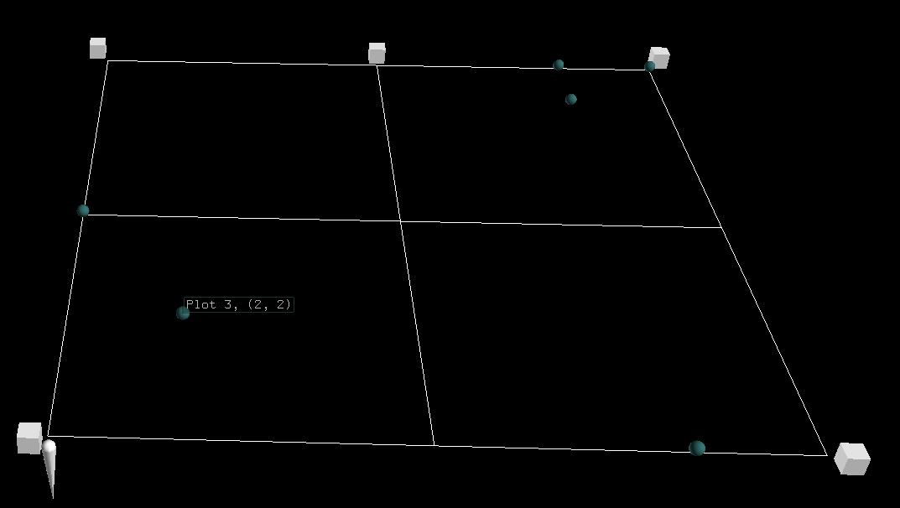
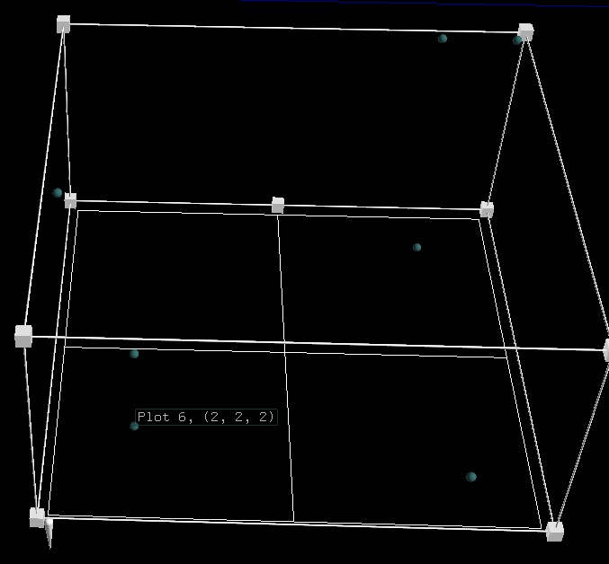
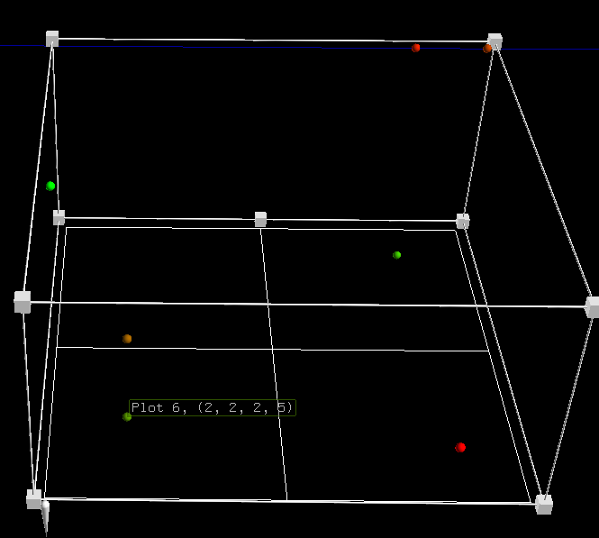
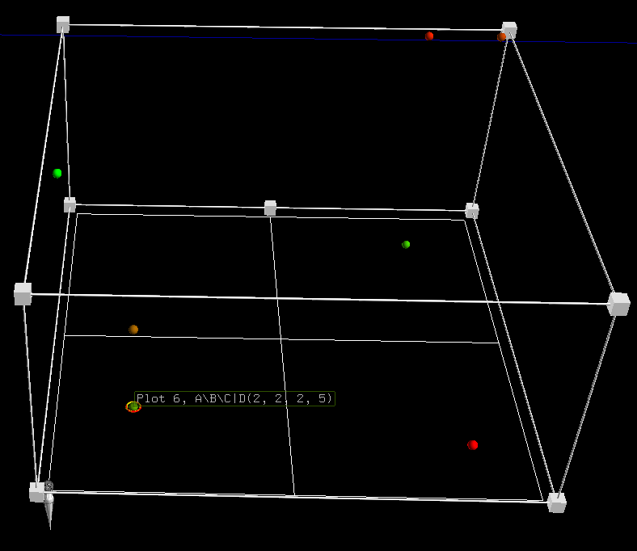
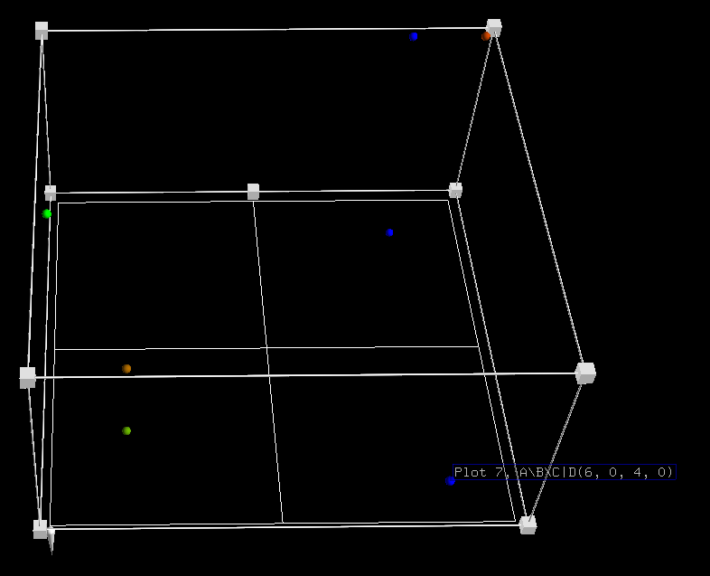
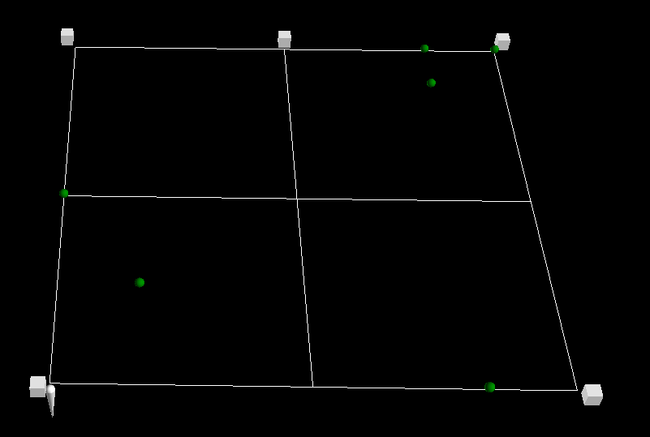
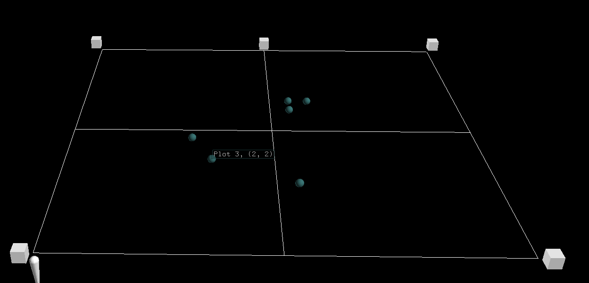
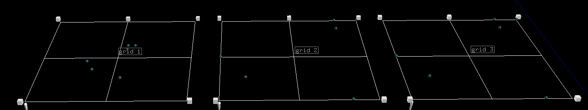

scatter_plot
------------
Adds a grid with a grid handle with points plotted from a DataFrame to a NodeFile.

Parameters:

+---------------+------------------------------------------------------+-------------------------------+---------+
| Name          | Description                                          | Type                          | Default |
+===============+======================================================+===============================+=========+
| df            | DataFrame to plot points from.                       | DataFrame                     | N/A     |
+---------------+------------------------------------------------------+-------------------------------+---------+
| ntf           | NodeFile to add grid and plots too.                  | NodeFile                      | N/A     |
+---------------+------------------------------------------------------+-------------------------------+---------+
| grid_color    | Color of grid lines. Key from nodefileglobals.colors | bool                          | N/A     |
+---------------+------------------------------------------------------+-------------------------------+---------+
| key_column    | Column name used to uniquley identify each row.      |                               |         |
|               | The data in this column will be used in tags.        |                               |         |
|               | Can be None.                                         | str                           | N/A     |
+---------------+------------------------------------------------------+-------------------------------+---------+
| x_column      | Column name for data that is interpolated to place a |                               |         |
|               | plot along the x axis.                               | str                           | N/A     |
+---------------+------------------------------------------------------+-------------------------------+---------+
| y_column      | Column name for data that is interpolated to place a |                               |         |
|               | plot along the y axis.                               | str                           | N/A     |
+---------------+------------------------------------------------------+-------------------------------+---------+
| z_column      | Column name for data that is interpolated to place a |                               |         |
|               | plot along the z axis.                               | str                           | None    |
+---------------+------------------------------------------------------+-------------------------------+---------+
| color_column  | Column name for data that is interpolated between    |                               |         |
|               | the min and max color or the globally specified      |                               |         |
|               | pallete_id to color a plot.                          | str                           | None    |
+---------------+------------------------------------------------------+-------------------------------+---------+
| common_tag    | A string that will be added to every plots tag. Tag  |                               |         |
|               | for each plot will be formmated as key_column + ", " |                               |         |
|               |  + common_tag + '(' + x_column + ", " + y_column     | str                           | ""      |
+---------------+------------------------------------------------------+-------------------------------+---------+
| node_function | a user implemented function that takes in a Node and |                               |         |
|               | Series. If the function is not None, it will be      |                               |         |
|               | called after each plot is plotted. The function will |                               |         |
|               | be passed the plotted Node and the                   |                               |         |
|               | DataFrame.iterrows() series for that DataFrame       |                               |         |
|               | iteration loop.                                      | function(Node, Series)-> None |         |
+---------------+------------------------------------------------------+-------------------------------+---------+

Returns:
    tuple(Node, Node)

Raises:
    TypeError

Basic usage (2D scatter plot)::

	import matritools as mt
	import pandas as pd

	plots = {"Name": ["Plot 1", "Plot 2", "Plot 3", "Plot 4", "Plot 5", "Plot 6", "Plot 7"],
			 "A": [1, 6, 2, 6, 7, 2, 6],
			 "B": [4, 7, 2, 8, 8, 2, 0],
			 "C": [8, 2, 5, 9, 9, 2, 4],
			 "D": [8, 6, 3, 1, 2, 5, 0]}

	df = pd.DataFrame(plots)

	file_name = "my_file_name"

	ntf = mt.NodeFile(file_name)

	mt.scatter_plot(df, ntf, 'white', 'Name', 'A', 'B')

	ntf.write_to_csv()

Basic usage (3D scatter plot)::

	import matritools as mt
	import pandas as pd

	plots = {"Name": ["Plot 1", "Plot 2", "Plot 3", "Plot 4", "Plot 5", "Plot 6", "Plot 7"],
			 "A": [1, 6, 2, 6, 7, 2, 6],
			 "B": [4, 7, 2, 8, 8, 2, 0],
			 "C": [8, 2, 5, 9, 9, 2, 4],
			 "D": [8, 6, 3, 1, 2, 5, 0]}

	df = pd.DataFrame(plots)

	file_name = "my_file_name"

	ntf = mt.NodeFile(file_name)

	mt.scatter_plot(df, ntf, 'white', 'Name', 'A', 'B', 'C')

	ntf.write_to_csv()

Basic Usage (4D scatter plot)::

	import matritools as mt
	import pandas as pd

	plots = {"Name": ["Plot 1", "Plot 2", "Plot 3", "Plot 4", "Plot 5", "Plot 6", "Plot 7"],
			 "A": [1, 6, 2, 6, 7, 2, 6],
			 "B": [4, 7, 2, 8, 8, 2, 0],
			 "C": [8, 2, 5, 9, 9, 2, 4],
			 "D": [8, 6, 3, 1, 2, 5, 0]}

	df = pd.DataFrame(plots)

	file_name = "my_file_name"

	ntf = mt.NodeFile(file_name)

	mt.scatter_plot(df, ntf, 'white', 'Name', 'A', 'B', 'C', 'D')

	ntf.write_to_csv()

Basic Usage (4D scatter plot)::

	import matritools as mt
	import pandas as pd

	plots = {"Name": ["Plot 1", "Plot 2", "Plot 3", "Plot 4", "Plot 5", "Plot 6", "Plot 7"],
			 "A": [1, 6, 2, 6, 7, 2, 6],
			 "B": [4, 7, 2, 8, 8, 2, 0],
			 "C": [8, 2, 5, 9, 9, 2, 4],
			 "D": [8, 6, 3, 1, 2, 5, 0]}

	df = pd.DataFrame(plots)

	file_name = "my_file_name"

	ntf = mt.NodeFile(file_name)

	mt.scatter_plot(df, ntf, 'white', 'Name', 'A', 'B', 'C', 'D', "A\B\C|D")

	ntf.write_to_csv()

Advanced Usage (4D scatter plot)::

	import matritools as mt
	import pandas as pd

	plots = {"Name": ["Plot 1", "Plot 2", "Plot 3", "Plot 4", "Plot 5", "Plot 6", "Plot 7"],
			 "A": [1, 6, 2, 6, 7, 2, 6],
			 "B": [4, 7, 2, 8, 8, 2, 0],
			 "C": [8, 2, 5, 9, 9, 2, 4],
			 "D": [8, 6, 3, 1, 2, 5, 0]}

	df = pd.DataFrame(plots)

	file_name = "my_file_name"

	ntf = mt.NodeFile(file_name)

	def my_node_function(node, row):
		if row['A'] == 6:
			node.set_color_by_name('blue')

	mt.scatter_plot(df, ntf, 'white', 'Name', 'A', 'B', 'C', 'D', "A\B\C|D", my_node_function)

	ntf.write_to_csv()

Advanced Usage (2D scatter plot)::

	import matritools as mt
	import pandas as pd

	plots = {"Name": ["Plot 1", "Plot 2", "Plot 3", "Plot 4", "Plot 5", "Plot 6", "Plot 7"],
			 "A": [1, 6, 2, 6, 7, 2, 6],
			 "B": [4, 7, 2, 8, 8, 2, 0],
			 "C": [8, 2, 5, 9, 9, 2, 4],
			 "D": [8, 6, 3, 1, 2, 5, 0]}

	df = pd.DataFrame(plots)

	file_name = "my_file_name"

	ntf = mt.NodeFile(file_name)

	# edit plot template before plotting
	mt.scatter_plot_template.set_color_by_name('green')

	mt.scatter_plot(df, ntf, 'white', 'Name', 'A', 'B')

	ntf.write_to_csv()

Advanced Usage (Custom min and max for when data does not express true range of a value)::

	import matritools as mt
	import pandas as pd

	plots = {"Name": ["Plot 1", "Plot 2", "Plot 3", "Plot 4", "Plot 5", "Plot 6", "Plot 7"],
			 "A": [1, 6, 2, 6, 7, 2, 6],
			 "B": [4, 7, 2, 8, 8, 2, 0],
			 "C": [8, 2, 5, 9, 9, 2, 4],
			 "D": [8, 6, 3, 1, 2, 5, 0]}

	df = pd.DataFrame(plots)

	file_name = "my_file_name"

	ntf = mt.NodeFile(file_name)

	mt.set_scatter_x_column(-5, 15)
	mt.set_scatter_y_column(-5, 15)
	mt.set_scatter_z_column(-5, 15)

	mt.scatter_plot(df, ntf, 'white', 'Name', 'A', 'B')

	ntf.write_to_csv()

Advanced Usage (Placing multiple grids and editing grids and handles)::

	import matritools as mt
	import pandas as pd

	plots = {"Name": ["Plot 1", "Plot 2", "Plot 3", "Plot 4", "Plot 5", "Plot 6", "Plot 7"],
			 "A": [1, 6, 2, 6, 7, 2, 6],
			 "B": [4, 7, 2, 8, 8, 2, 0],
			 "C": [8, 2, 5, 9, 9, 2, 4],
			 "D": [8, 6, 3, 1, 2, 5, 0]}

	df = pd.DataFrame(plots)

	file_name = "my_file_name"

	ntf = mt.NodeFile(file_name)

	mt.set_scatter_x_column(-5, 15)
	mt.set_scatter_y_column(-5, 15)
	mt.set_scatter_z_column(-5, 15)

	for i in range(3):

		grid_handle, grid = mt.scatter_plot(df, ntf, 'white', 'Name', 'A', 'B')

		grid_handle.set_translate(i * 60)
		grid.set_tag(f"grid {i+1}", 1)

	ntf.write_to_csv()

